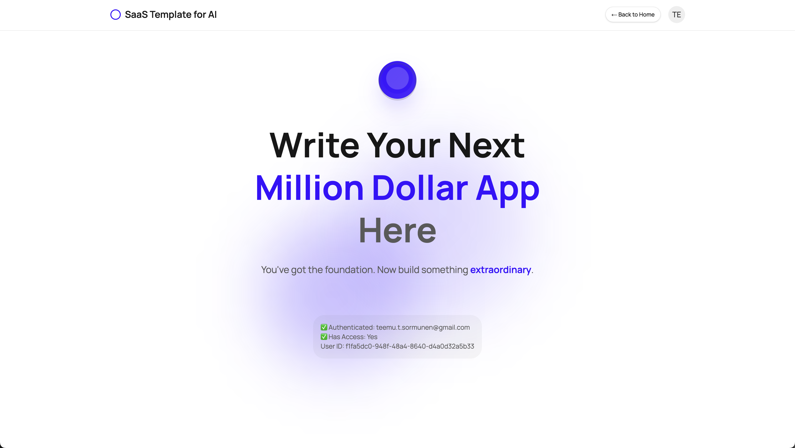

# SaaS Template Lite

A beginner-friendly SaaS boilerplate built with Next.js 15, TypeScript, and Supabase. Get your SaaS up and running in minutes, not days.

<div align="center">
  
</div>

The easiest way to get started is to watch the video below.

<div align="center">
  <a href="https://youtu.be/hLDD-ho_o4Y">
    
  </a>
</div>

<div align="center">
  <a href="https://youtu.be/hLDD-ho_o4Y">
    <strong>▶️ Watch Demo Video</strong>
  </a>
</div>

## ✨ What You Get

- **🔐 Complete Auth System** - Sign up, login, password reset
- **💳 Payment Integration** - Stripe one-time payments
- **🎨 Beautiful UI** - Modern design with Tailwind CSS
- **📱 Mobile Ready** - Works perfectly on all devices
- **🛡️ Secure by Default** - Database security and rate limiting
- **🚀 Production Ready** - Deploy to Vercel in one click

## Do you need help building?

I can help you finalize your application through 1-to-1 mentoring and application review, or by building the full MVP. Check out my offering at [Teemu Sormunen proto-to-MVP](https://teemusormunen.centrive.ai/mvp) page.

## 🏃‍♂️ Quick Start

### 1. Clone & Install
```bash
git clone git@github.com:TeemuSo/saas-template-for-ai-lite.git
cd saas-template-lite
pnpm install
```

### 2. Choose Your Setup

**Option A: Development Only (No Payment Required)**
```bash
# Copy environment file
cp .env.example .env.local

# Set up Supabase (free tier)
supabase link --project-ref your-project-id
supabase db push

# Apply optional migration to disable payments
supabase db push --file supabase/optional_migrations/20250713170112_allow_access_to_app_without_payment.sql

# Start development
pnpm dev
```

**Option B: Full Setup with Payments**
See [SETUP.md](./SETUP.md) for complete setup with Stripe integration.

### 3. You're Ready!
Visit [http://localhost:3000](http://localhost:3000) and start building your SaaS!

## 🏗️ Project Structure

```
saas-template-lite/
├── app/                    # Next.js 15 App Router
│   ├── (login)/           # Auth pages (sign-in, sign-up)
│   ├── api/               # API routes
│   ├── app/               # Protected app area
│   └── page.tsx           # Landing page
├── lib/                   # Core utilities
│   ├── auth/              # Authentication (DAL pattern)
│   ├── db/                # Database operations
│   ├── payments/          # Stripe integration
│   └── supabase/          # Supabase client config
├── components/            # React components
│   └── ui/               # Reusable UI components
└── middleware.ts          # Route protection & rate limiting
```

## 🎨 Customization

### Change Your Brand Colors (30 seconds)
Edit `app/globals.css`:
```css
--primary: 220 91% 60%;    /* Your brand color */
--neutral: 220 9% 45%;     /* Gray shade */
```

### Key Files to Customize
- **Landing Page**: `app/page.tsx` - Your marketing page
- **App Dashboard**: `app/app/page.tsx` - Main app interface
- **Hero Section**: `components/hero-section.tsx` - Landing hero
- **Configuration**: `lib/config.ts` - App settings

## 🔧 Development vs Production

### Development Mode (No Payments)
Perfect for building and testing your SaaS:
1. Run the optional migration to disable payments
2. Users automatically get access to `/app`
3. Focus on building your core features

### Production Mode (With Payments)
When ready to launch:
1. Set up Stripe (see [SETUP.md](./SETUP.md))
2. Don't run the optional migration
3. Users must pay to access `/app`

## 🚀 What's Next?

1. **Build Your Features** - Add your SaaS functionality in `app/app/`
2. **Customize Design** - Update colors, fonts, and layout
3. **Add Your Content** - Replace placeholder text and images
4. **Deploy** - Push to Vercel for instant deployment

## 📚 Documentation

- **[Setup Guide](./SETUP.md)** - Complete setup with payments
- **[Styling Guide](./STYLING.md)** - Design system details
- **[Auth Guide](./lib/auth/README.md)** - Authentication patterns
- **[Database Guide](./lib/db/README.md)** - Database operations

## 📁 Repository Map

```
saas-template-lite/
├── app/                    # Next.js App Router
│   ├── (login)/           # Authentication pages
│   ├── api/               # API routes
│   ├── app/               # Main application
│   └── auth/              # Auth callbacks
├── components/            # Reusable UI components
├── lib/                   # Utilities and configurations
│   ├── auth/              # Authentication logic
│   ├── db/                # Database queries
│   ├── payments/          # Stripe integration
│   └── supabase/          # Supabase client
├── docs/                  # Documentation assets (README videos/images)
│   ├── videos/            # Video demonstrations
│   └── images/            # Documentation images
├── public/                # Static assets (included in build)
└── supabase/              # Database schema and migrations
```

## 🛠️ Tech Stack

- **Framework**: Next.js 15 with App Router
- **Database**: PostgreSQL (Supabase)
- **Auth**: Supabase Auth
- **Payments**: Stripe
- **Styling**: Tailwind CSS
- **UI**: Radix UI + shadcn/ui
- **TypeScript**: Full type safety

## 🚀 Deploy to Production

### Vercel (Recommended)
1. Push to GitHub
2. Import to [Vercel](https://vercel.com)
3. Add environment variables
4. Deploy!

### Environment Variables
```env
# Required for any database of auth operations
NEXT_PUBLIC_SUPABASE_URL=your-supabase-url
NEXT_PUBLIC_SUPABASE_ANON_KEY=your-anon-key
SUPABASE_SERVICE_ROLE_KEY=your-service-key
# Only needed if using payments
STRIPE_SECRET_KEY=your-stripe-key       
STRIPE_WEBHOOK_SECRET=your-webhook-secret
STRIPE_PRICE_ID=your-price-id
```

## 💡 Tips for Beginners

- **Start Simple**: Use development mode first, add payments later
- **Focus on Features**: Build your core SaaS functionality first
- **Customize Gradually**: Change colors, then layout, then add features
- **Read the Code**: Everything is documented and easy to understand

## 🆘 Need Help?

- **Setup Issues**: Check [SETUP.md](./SETUP.md) troubleshooting
- **Code Questions**: Everything is documented inline
- **Stuck?**: Open an issue with your question

## 📄 License

MIT License applies.

---

**Ready to build your SaaS?** 🚀

This template handles all the boring stuff (auth, payments, UI) so you can focus on building something awesome. Perfect for beginners who want to learn by doing!
